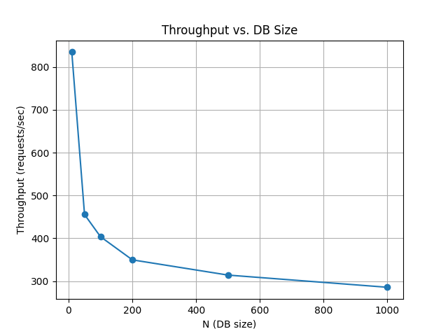
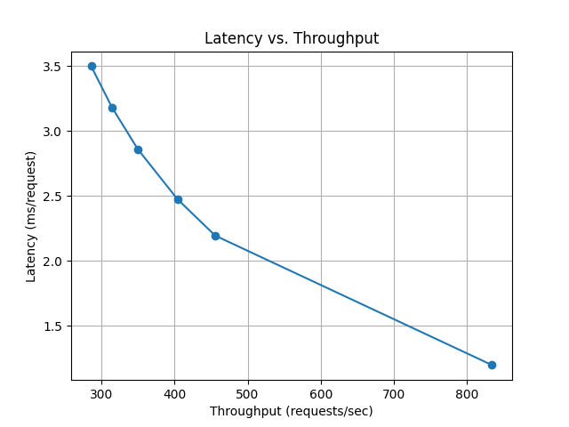

# Design Document

## Architecture Overview

[This project](https://github.com/jonco5555/ORAM) implements a [Path ORAM](https://eprint.iacr.org/2013/280.pdf) system in Python, consisting of a `Client` and a `Server`:

- **Server**: Stores the data as a binary tree of encrypted buckets. Each bucket contains a fixed number of blocks, and each block can hold a data item.
- **Client**: Maintains a stash (temporary storage), a position map (mapping block IDs to leaf indices), and handles encryption/decryption. The client is responsible for all logic related to data access, privacy, and remapping.

### Data Flow

1. **Initialization**: The client generates encryption keys and initializes the server's tree with encrypted dummy blocks.
2. **Store Data**: The client:
    * remaps the block to a new random leaf
    * fetches and decrypts the path from the server
    * updates the stash with real blocks from the path
    * writes the new data
    * rebuilds the path with blocks from the stash and encrypts the path
    * sends it back to the server
3. **Retrieve Data**: The client:
    * remaps the block to a new random leaf
    * fetches and decrypts the path from the server
    * updates the stash with real blocks from the path
    * retrieves the data
    * rebuilds the path with blocks from the stash and encrypts the path
    * sends it back to the server
4. **Delete Data**: The client:
    * remaps the block to a new random leaf
    * fetches and decrypts the path from the server
    * updates the stash with real blocks from the path
    * removes the block from the stash and the map
    * rebuilds the path with blocks from the stash and encrypts the path
    * sends it back to the server

### Security and Privacy

- All data on the server is encrypted with a key only known to the client.
- I used `cryptography.fernet` package, that uses `AES` in `CBC` mode with a 128-bit key for encryption and `HMAC` using `SHA256` for authentication.
- The access pattern is obfuscated by always reading and writing a full path from the root to a random leaf, regardless of the operation.
- The stash ensures that blocks are not lost during path rebuilding.

### Requirements Satisfied

- **Obliviousness**: The server cannot distinguish which data is being accessed due to the randomized remapping and full-path operations.
- **Encryption**: All data is encrypted at rest and in transit between client and server.

## Benchmarks

The benchmark considers each client's API call as a request.
It iterates over different DB sizes, and for each one it:
* calls `store_data` and the `retrieve_data` `N` times
* calls `retrieve_data` and `delete_data` `N` times
* repeats this maximum 1000 times, depends on `N`

In total it runs `1000 * 4` requests for each DB size.

### Throughput (requests/sec) vs. DB Size (blocks)

We can see that throughput decreases as the database size increases, which is expected due to the increased complexity of path traversal.

### Latency (msec) vs. Throuput (requests/sec)

We can see that when throughput increases, latency decreases. It makes sense because when the throughput is high, the DB size is smaller, and the path traversal is simpler.

## Multicore Benefits

The current implementation is single-threaded and does not natively benefit from multicore CPUs.
Also it is designed for sequential operations.

However, the architecture could be extended to support parallelism, for example by:

- Running multiple client operations in parallel
- Parallelizing encryption/decryption of buckets or blocks.

---
